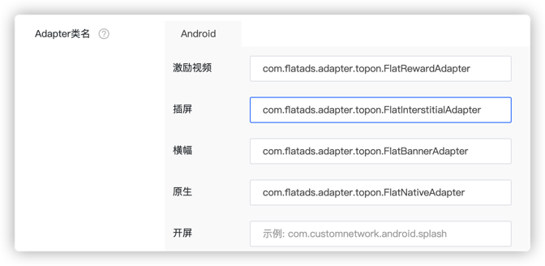
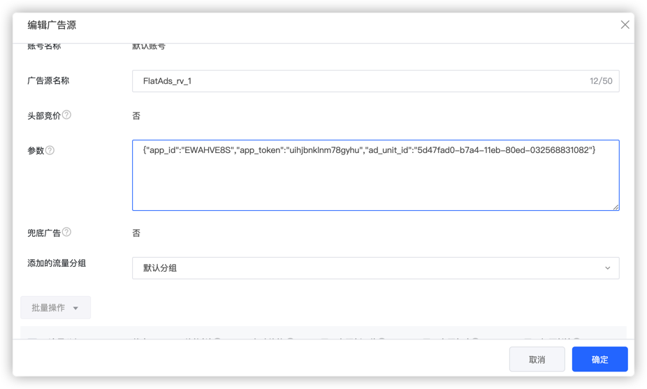

# Flat-TopOn-Adapter

## 发版记录

| 版本       | 发布时间       | 更新内容                     |
|----------|------------|--------------------------|
| 1.5.2.0  | 2024-12-05 | 优化                       |
| 1.4.18.0 | 2023-10-20 | 抽离Adapter，后续只需要更新SDK版本即可 |
| 1.4.15   | 2023-05-19 | 发布第一个版本                  |

## 引入Adapter

首先在项目级build.gradle文件加入maven远程依赖地址，如下：
```groovy
buildscript {
    repositories {
        maven { url "https://maven-pub.flat-ads.com/repository/maven-public/"}
        maven { url "https://jitpack.io" }
    }
}
allprojects {
    repositories {
        maven { url "https://maven-pub.flat-ads.com/repository/maven-public/"}
        maven { url "https://jitpack.io" }
    }
}

classpath("io.github.prototypez:app-joint:1.7")
```
然后再Module的build.gradle中引入TopOn Adapter的包，根据项目情况选择
```groovy
// 必须导入
implementation 'com.flatads.adapter:topon:1.5.2.0'

// 以下按渠道导入
// GP
implementation 'com.flatads.sdk:flatads:1.5.2.0-Flat'

```
## 在TopOn用户界面中定义Adapter
* 配置ClassName
  * Banner ：com.flatads.adapter.topon.FlatBannerAdapter
  * Native ：com.flatads.adapter.topon.FlatNativeAdapter
  * Interstitial ：com.flatads.adapter.topon.FlatInterstitialAdapter
  * Rewarded ：com.flatads.adapter.topon.FlatRewardAdapter

* 配置广告ID

```json
{"app_id":"EWAHVE8S","app_token":"uihjbnklnm78gyhu","ad_unit_id":"5d47fad0-b7a4-11eb-80ed-032568831082"}
```
需要配置对应的广告ID，APP_ID，APP_TOKEN