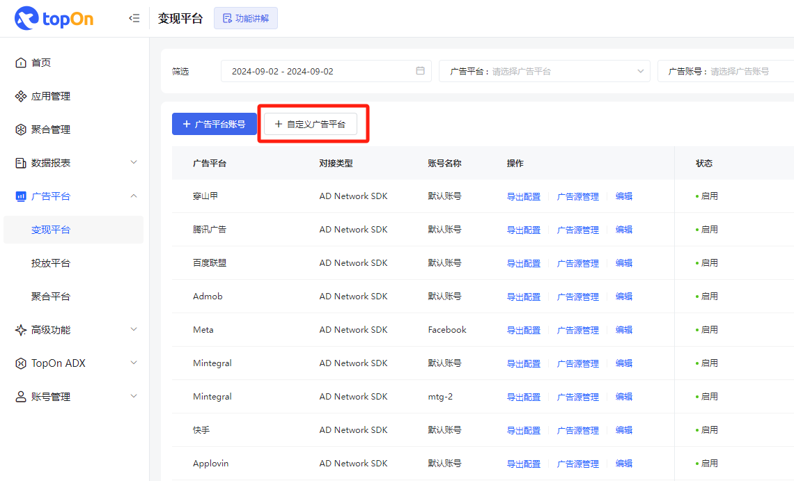
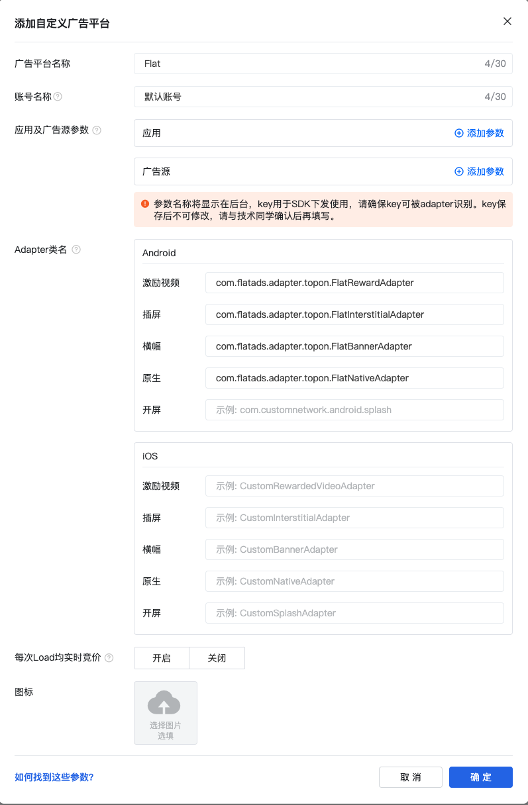
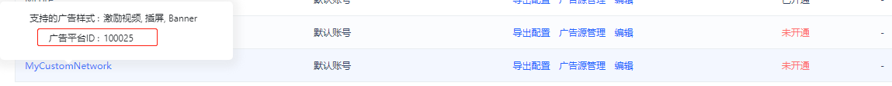
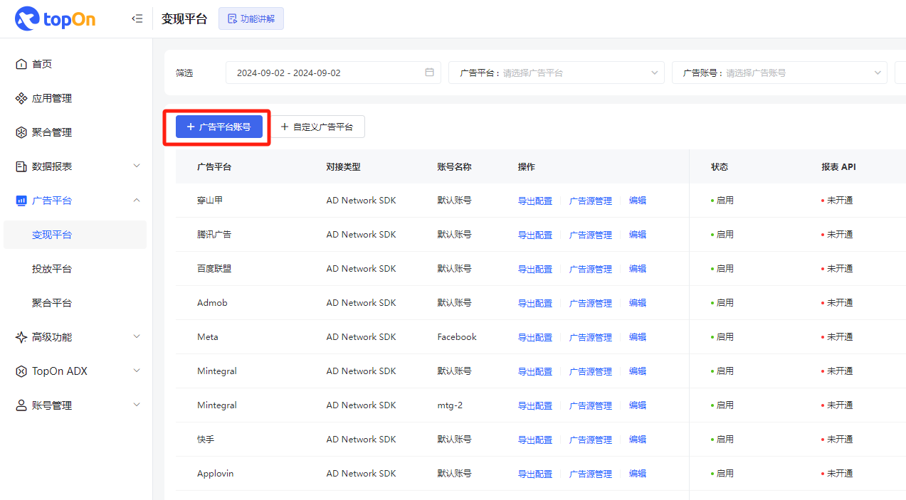
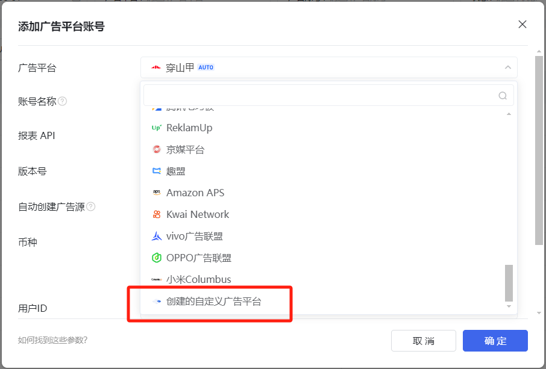
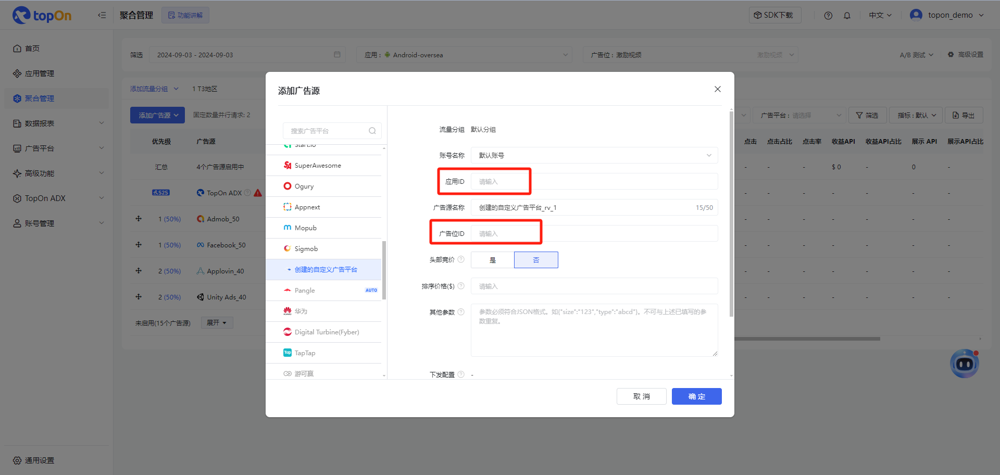
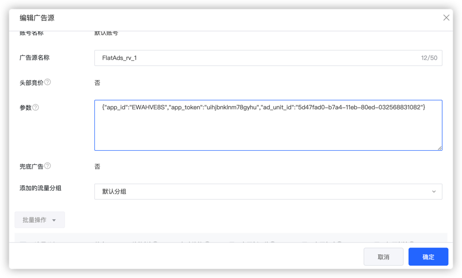
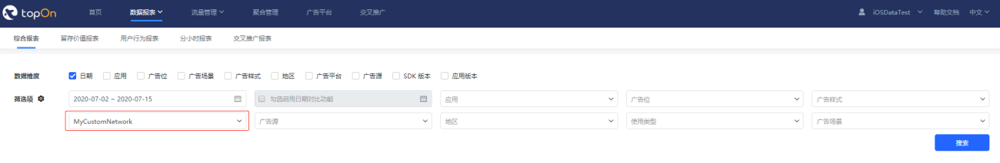

# Flat-TopOn-Adapter

## 发版记录

| 版本       | 发布时间       | 更新内容                     |
|----------|------------|--------------------------|
| 1.5.2.0  | 2024-12-23 | 优化文案                       |
| 1.5.2.0  | 2024-12-05 | 更新版本至 v1.5.2.0                       |
| 1.4.18.0 | 2023-10-20 | 抽离Adapter，后续只需要更新SDK版本即可 |
| 1.4.15   | 2023-05-19 | 发布第一个版本                  |

## 背景

使用 TopOn 聚合功能, 能帮助开发者快速接入Flat Ads SDK.

---

## TopOn 后台Flat广告平台配置

### Step1. 创建Topon Flat 广告平台

#### (1) 添加广告平台账号配置

① 若您未添加过Flat广告平台，可点击添加自定义广告平台入口，添加Flat广告平台



② 填写Flat广告平台信息和填写需要使用的广告样式的Adapter

| ⚠️ 注意：Android平台请填写如下图所示 Adapter 的全路径类名



#### 广告类型对应关系

|TopOn 广告类型|Flat 广告类型|类名|是否支持Bidding|                    
|-|-|-|-|
|激励视频| 激励视频 (RewardedAd)|com.flatads.adapter.topon.FlatRewardAdapter|否 |
|插屏| Interstitial(InterstitialAd)|com.flatads.adapter.topon.FlatInterstitialAdapter|否 |
|横幅| Banner广告(BannerAdView)|com.flatads.adapter.topon.FlatBannerAdapter|否 |
|原生| Native(NativeAd)|com.flatads.adapter.topon.FlatNativeAdapter|否 |
---


#### (2) 查看Flat广告平台的Network Firm ID

TopOn SDK支持在回调中返回广告源的信息，其中包括当前广告源所属的广告平台。您可以在广告平台列表中查看已添加的自定义广告平台的Network Firm ID



### Step2. 添加Flat广告平台账号

若您已经添加过Flat广告平台，需要创建另外的账号，可以直接添加Flat广告平台账号





### Step3. 创建Flat广告平台的应用和广告位

在您需要添加的Flat广告平台上创建应用和广告位等信息（请到对应广告平台后台操作）

### Step4. 添加Flat广告平台的广告源

您可以在TopOn后台的聚合管理和广告平台页面添加Flat广告平台的广告源。

① 在添加Flat广告平台的广告源时，需要填写该广告源的参数。

② 广告源的参数将通过TopOn SDK传递给Flat广告平台的Adapter使用。

| 若已在广告平台账号管理页面，有添加应用和广告源参数，则在添加广告源的时候可以看到对应的参数可以直接填写



③ 必须在参数中包含Flat Ads 广告平台 SDK需要的全部参数: 1. App ID (应用ID), 2. App token (应用秘钥), 3.Ad Unit ID (广告位ID)。



```json 
// 示例如下
{"app_id":"EWAHVE8S","app_token":"uihjbnklnm78gyhu","ad_unit_id":"5d47fad0-b7a4-11eb-80ed-032568831082"}
```

④ 最后下发的参数以页面显示的【下发配置】显示内容为准

⑤ Flat Ads 广告源暂不支持自动价格

### Step5. TopOn SDK 接入 Flat Adapter 

首先在项目级build.gradle文件加入maven远程依赖地址，如下：
```groovy
buildscript {
    repositories {
        // Flat 仓库
        maven { url "https://maven-pub.flat-ads.com/repository/maven-public/"}
        // TopOn 仓库
        maven { url "https://jfrog.anythinktech.com/artifactory/overseas_sdk"}
        // 第三方库仓库
        maven { url "https://jitpack.io" }
    }
}
allprojects {
    repositories {
        // Flat 仓库
        maven { url "https://maven-pub.flat-ads.com/repository/maven-public/"}
        // TopOn 仓库
        maven { url "https://jfrog.anythinktech.com/artifactory/overseas_sdk"}
        // 第三方库仓库
        maven { url "https://jitpack.io" }
    }
}


```
然后再Module的build.gradle中引入TopOn Adapter的包，根据项目情况选择
```groovy
// Adapter 包
implementation 'com.flatads.adapter:topon:1.5.2.0'
// SDK 主包
implementation 'com.flatads.sdk:flatads:1.5.2.0-Flat'

```

### Step6. 查看Flat广告平台的数据

您可以在TopOn后台的综合报表中查看自定义广告平台的数据。

自定义广告平台已支持手动上传数据，请在 开发者后台操作指南 -> 上传三方数据 章节查看具体上传步骤



参考: [TopOn-自定义广告平台](https://newdocs.toponad.com/docs/fRMh7C)